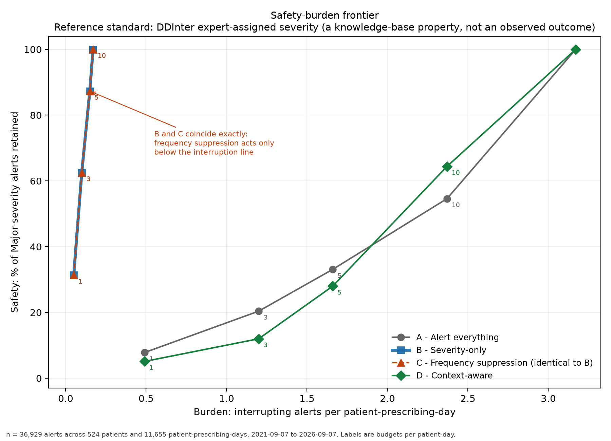
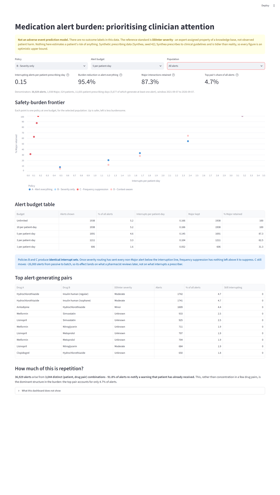

# Medication Alert Burden: Prioritising Clinician Attention

A context-aware analysis of drug–drug interaction alert burden using synthetic
prescribing data.

---

> ## ⚠️ Not an adverse-event prediction model
>
> **There are no outcome labels in this data.** Synthea records prescribing
> events and no observed medication-related harm. Nothing here predicts a
> patient's risk of anything, because "risk of what?" has no defensible answer
> in this dataset.
>
> The reference standard is **DDInter severity** — an expert-assigned property
> of a knowledge base, not an observed patient outcome. A `Major` alert means
> "DDInter graded this drug pair Major". It does not mean anyone was harmed.
>
> This project asks a **prioritisation** question: given a fixed amount of
> clinician attention, which alerts deserve it?

---

## The problem

Over 90% of drug–drug interaction alerts are overridden. In one large teaching
hospital, **88.2% of *very severe* DDI alerts were overridden** across 38,409
alerts. The obvious conclusion — that the alerts are wrong and should be
suppressed — is not supported by the evidence.

Clinicians deem most alerts not clinically significant, yet **more than half of
overrides are themselves inappropriate**, and inappropriate overrides carry
roughly **six times more adverse drug events**. Both the alerting and the
overriding are unreliable. Published causes are consistent: screening intervals
too broad, and failure to incorporate patient-specific characteristics. One
hospital found a **single drug pair generating 49.8% of all alerts**, 92.2% of
them overridden.

So the problem is not detection. It is allocation of a finite resource.

## The decision this supports

A pharmacy informatics lead deciding **which alerts interrupt a prescriber,
which are passive, and which are batched or suppressed** — and what that choice
costs in coverage of serious interactions.

## Two layers, kept separate

| Layer | Question | What it is |
|---|---|---|
| **1. Detection** | Does an interaction exist, at what severity? | Drug pair → DDInter. A lookup, not a model. |
| **2. Prioritisation** | Should *this instance* interrupt? | Output is a priority tier: **interrupt / passive / batch**. A policy choice, not a prediction. |

---

## What it does — headline results

**36,929 alerts** across **20,922 prescriptions**, **951 patients** and **472
practices** over **1,826 days** (2021-09-07 to 2026-09-07).

- **3.17 alerts per patient-prescribing-day**; 6.51 on days that alert at all
- 1.77 alerts per prescription; 38.8 per patient over five years
- **524 patients (55.1%)** of those prescribed for received at least one
- **580 distinct interacting pairs**

### Severity mix

| Severity | Alerts | Share |
|---|---:|---:|
| **Unknown** | 20,681 | **56.0%** |
| Moderate | 11,960 | 32.4% |
| Minor | 2,350 | 6.4% |
| Major | 1,938 | 5.2% |

### The dominant structure is repetition, not concentration

**3,044 distinct (patient, drug pair) combinations generate all 36,929 alerts.
91.8% of every alert re-notifies a warning that patient has already received** —
a mean of 12.1 repeats, up to **350** for one combination.

Pair concentration is comparatively weak: the top pair is 4.7% of alerts, and
90 pairs (15.5%) generate 80%. That is roughly an order of magnitude flatter
than the published 49.8%-from-one-pair figure — see [limitations](#6-the-evaluation-problem).

Burden concentrates far harder in **patients** than in pairs: **69 of the 524
alerting patients (13.2%) have a renal condition and average 399 alerts each,
against 21 for everyone else.**

---

## 5. What I chose not to build, and why

**A prescriber-level burden metric.** The obvious headline for this project is
"alerts per prescriber per day". Synthea's encounter provider is 100% populated
and joins cleanly to every prescription — which is exactly what makes it
dangerous. Provider is 1:1 with organisation (817 of each), every provider is
`GENERAL PRACTICE`, and the median provider is active on **8 days in five years,
writing 1.83 orders on each**. A per-prescriber rate would have been clean,
reproducible and fabricated. Burden is denominated per patient-prescribing-day
instead.

**Any outcome or harm variable.** No synthetic adverse events, no assumption
that a Major interaction "would have" caused harm. There is no honest way to
manufacture one.

**A fitted model for Policy D.** Weights are assigned by clinical reasoning and
stated in the code. Fitting them against the safety metric would make D's
performance circular, and an opaque model cannot be explained to the person who
has to sign off on suppressing alerts.

**FAERS integration.** A day of drug normalisation for a heavily caveated
directional result. Named in [what real use would need](#9-what-would-be-needed-for-real-use).

**Drug–allergy, drug–disease, dose-range and duplicate-therapy alerting.**
Real contributors to alert burden, deliberately out of scope. This project is
about DDI alerts only, and the burden figures should be read as a lower bound on
total CDS burden.

**Gini coefficients and Pareto formalism.** "90 pairs generate 80% of alerts" is
legible to a pharmacy lead in one reading. A Gini coefficient is decoration.

**A `.pbix` in the repo.** Power BI Desktop is not installed on the machine this
was built on. Rather than claim a deliverable that is not here, the Streamlit app
is the runnable dashboard and
[`dashboard/POWERBI_DATA_CONTRACT.md`](dashboard/POWERBI_DATA_CONTRACT.md)
specifies exactly what a `.pbix` binds to.

---

## 6. The evaluation problem

This is the section that matters. A project about alert reliability that is
vague about its own reliability undercuts itself.

### There are no outcome labels, and what was used instead is weak

The reference standard is DDInter severity. Its weaknesses, stated before
results were seen (see [`eval/criteria.md`](eval/criteria.md), committed before
any prioritisation code existed):

**It grades pairs, not situations.** A `Major` pair is major in general — not
major for this patient, at this dose, on this day.

**Coverage gaps cap everything.** 18.0% of ingredient-prescriptions involve
drugs absent from DDInter and can never alert under any policy. The largest is
**epoetin alfa at 8,760 prescriptions — the single most-prescribed product in
the cohort, with zero interaction coverage.** Every "total burden" figure here
is a statement about the 82% DDInter can see.

**`Unknown` is not a low-severity grade.** It is 18% of DDInter but **56% of the
realised alert set**, because the drugs this cohort co-prescribes are
disproportionately ungraded. It is reported as its own tier throughout.
Folding it into `Minor` would have suppressed over half the alerts on no
evidence and handed Policies B and C a large, flattering burden reduction that
was an artefact of grading gaps.

**No override data exists.** The finding that motivates this project — that
>90% of alerts are overridden but >half of overrides are inappropriate at ~6×
the adverse event rate — cannot be reproduced or tested here. There is no
clinician response to observe.

### The burden figure moves by 2× on one assumption

Synthea leaves `STOP` null on 4.87% of prescriptions, meaning "still active".
Whether two prescriptions are concurrent depends on how that is read:

| Overlap rule | Alerts | vs primary | Major |
|---|---:|---:|---:|
| **assume_active** (primary) | **36,929** | 100% | 1,938 |
| assume_90d | 18,576 | 50.3% | 639 |
| assume_30d | 18,416 | 49.9% | 636 |
| assume_point | 18,042 | 48.9% | 631 |
| same_day_only | 15,230 | 41.2% | 662 |

**4.87% of prescriptions determine 50% of the burden.** The rule was fixed
before results and is reported with every headline. Note that Major counts
barely move across the bounded rules (631–662) — the assumption inflates *noise*
far more than it inflates what matters.

### Other known distortions

- **19.5% of alerts** involve a drug that may not be systemically absorbed.
  Ingredient-level normalisation cannot distinguish an inhaler, eye drop or
  fluoride gel from a tablet. 358 of these are Major.
- **Dose is destroyed** by ingredient-level normalisation, and interaction
  severity is often dose-dependent. Not recoverable.
- **Concentration is flatter than the literature**, and this is a property of
  Synthea rather than a contradiction of published work: a 245-product formulary
  prescribed to clinical guidelines has no equivalent of the one misconfigured
  rule that generates half a real hospital's alerts.

### What net benefit means here, and what it does not

Stage 8 uses decision curve analysis because it is the framework that
**explicitly trades false positives against false negatives across a range of
thresholds** — which is literally the alert-fatigue problem.

```
NB(p_t) = TP/n − (FP/n) × (p_t / (1 − p_t))
```

The "treatment" is **interrupting the prescriber**. `p_t` is the minimum
probability of a Major interaction at which an interruption is worth it, and
`p_t/(1−p_t)` is the **exchange rate**: at `p_t = 0.05` the analyst is stating
that one missed Major is worth nineteen needless interruptions. That term is the
whole argument for DCA over accuracy, which fixes an exchange rate silently. It
is hand-written in [`R/evaluation.R`](R/evaluation.R) rather than called from a
package so the term stays visible.

**What it does not mean:**

- **It does not demonstrate reduced adverse drug events.** The outcome is
  "DDInter graded this pair Major", a knowledge-base property. A policy scoring
  well has retained alerts an expert panel considers serious. It has not
  prevented anything.
- **The "true positive" is a weak proxy.** Some Major pairs are irrelevant for a
  given patient; some `Moderate` or `Unknown` pairs are dangerous for a specific
  one. Net benefit computed against an unreliable standard inherits its errors.
- **The threshold has no empirical anchor.** Nobody has told us the rate at
  which an interruption is worth a missed Major interaction. The curves show
  consequences across a range; they do not identify the right point on it.
- **Policy B's dominance is partly definitional.** B's rule is "interrupt iff
  severity is Major" and the outcome is "severity is Major", so **B has zero
  false positives by construction** — which is why its curve is flat and
  positive everywhere. The informative comparison is among the **label-blind**
  strategies, where Policy D fails to beat arbitrary selection. The defensible
  claim is not "B is excellent" but **"nothing that avoids using severity
  manages to approximate it"**.
- **Intervals describe Synthea, not a hospital.** They are clustered by patient,
  which handles dependence, but the cohort is synthetic and tidier than reality.

---

## 7. Can a simple rule outperform the complex policy?

**No. The simple rule wins decisively, and that is the finding.**

| Policy | Rule |
|---|---|
| **A** | Alert everything — every known interaction |
| **B** | Severity-only — `Major` interrupts, `Moderate`/`Unknown` passive, `Minor` batched |
| **C** | Frequency suppression — B plus batching of repeats within 90 days and top-10 pairs, `Major` always survives |
| **D** | Context-aware — ranks on patient features only; severity excluded by the leakage rule |

The success condition was **fixed in writing before any policy code was
written**: D beats B only by retaining **≥5 percentage points more Major alerts
at the 5-per-patient-day budget, at equal or lower burden.**

**At that budget:**

| | Interrupts | Per patient-prescribing-day | Major retained |
|---|---:|---:|---:|
| **B — severity only** | **1,691** | **0.15** | **87.3%** |
| D — context-aware | 19,372 | 1.66 | 28.0% |

**Margin: −59.3 pp, at 11× the burden.** D also **loses to Policy A — arbitrary
selection — at every budget below 10.** Policy D was **not retuned**.

### Why context fails, which is the substantive result

| Severity | Mean D score | Mean prior notifications | Share high-volume pairs |
|---|---:|---:|---:|
| Major | 0.15 | 54.5 | 0.0% |
| Moderate | 0.19 | 53.4 | 34.8% |
| Unknown | −0.06 | 45.6 | 22.4% |
| Minor | −0.50 | 42.4 | 68.5% |

Major and Moderate are **indistinguishable** by D's score. Worse, **Major alerts
carry the highest mean repeat count of any severity**, so the repeat penalty —
the strongest burden-reduction lever available — systematically demotes exactly
the alerts the safety metric protects.

**Patient context tells you which patients are complex. It does not tell you
which interactions are dangerous.** Polypharmacy, age and renal impairment are
properties of a person; severity is a property of a drug pair. A score built
from the first cannot recover the second.

Confirmed independently in R:

- **AUC 0.539**, patient-clustered 95% CI **0.304–0.622** — comfortably contains
  chance. (A naive logistic regression gives p = 0.00057; treating 36,929 alerts
  from 524 patients as independent is what produces that. **The clustered
  interval is the one that counts.**)
- **Net benefit −0.0126 (95% CI −0.0226 to −0.0002)** — D is worse than
  interrupting nobody.
- Calibration is **hump-shaped**, and the top-scoring decile sits *below* the
  overall Major rate.
- B leads in **every** pre-registered subgroup.

**Policy C is identical to Policy B on the interrupt set.** Once severity
routing has sent every non-Major alert below the interruption line, frequency
suppression has nothing left above it to suppress. C still moves 26,277 alerts
from passive to batch, so its entire effect lands on what a pharmacist reviews
later.

**The practical recommendation is the simple system** — one a pharmacy lead can
explain in a sentence and defend in a governance meeting.

---

## 8. The alert budget and the safety–burden frontier



Budget is expressed **per patient-prescribing-day**. A prescriber attends to one
patient at a time, so this is the interruption they actually experience.

**Policy A — alert everything**

| Budget | Alerts shown | % of total | Major captured |
|---|---:|---:|---:|
| Unlimited | 36,929 | 100% | 100% |
| 10 / patient-day | 27,609 | 74.8% | 54.6% |
| 5 / patient-day | 19,372 | 52.5% | 33.1% |
| 3 / patient-day | 13,975 | 37.8% | 20.4% |
| 1 / patient-day | 5,677 | 15.4% | 7.8% |

**Policy B — severity only**

| Budget | Alerts shown | % of total | Major captured |
|---|---:|---:|---:|
| Unlimited | 1,938 | 5.2% | 100% |
| 10 / patient-day | 1,938 | 5.2% | 100% |
| **5 / patient-day** | **1,691** | **4.6%** | **87.3%** |
| 3 / patient-day | 1,211 | 3.3% | 62.5% |
| 1 / patient-day | 606 | 1.6% | 31.3% |

**Where the trade-off bites.** Policy B holds 100% of Major coverage at 5.2% of
the burden — the sharpest available reduction, and it costs nothing on the
safety metric. Below roughly 3 alerts per patient-day, further reduction starts
costing Major coverage quickly: 87.3% at budget 5, 62.5% at 3, 31.3% at 1. **The
knee is between budgets 5 and 3.** Under Policy A, by contrast, every burden
reduction is paid for immediately in safety, because there is no ordering.

## Dashboard

An interactive policy simulator: policy selector, budget slider, subgroup
filter, KPI cards, the frontier, and top alert-generating pairs.

```bash
.venv/Scripts/streamlit run dashboard/app.py
```



---

## 9. What would be needed for real use

Nothing here is deployment-ready, and nothing here demonstrates clinical
validity.

1. **Real prescribing data.** Synthea prescribes to clinical guidelines with a
   245-product formulary. Real prescribing is messier, wider, and generates the
   long tail this cohort does not have.
2. **Real override logs.** The central question — which alerts *should* have
   interrupted — is unanswerable without knowing what clinicians did and what
   happened next. This is the single largest gap.
3. **Outcome linkage.** Adverse drug event data, so "high-severity capture"
   can be replaced by something that is actually an outcome.
4. **FAERS validation.** Deliberately out of scope here: a day of drug
   normalisation for a heavily caveated directional signal. Worth doing with
   real data behind it.
5. **Multi-source interaction knowledge.** DDInter is one expert base among
   several that disagree. Agreement between them is itself a prioritisation
   signal.
6. **Prospective evaluation.** Every result here is retrospective on synthetic
   data. The post-hoc observation that 1,938 Major alerts arise from just **78
   distinct (patient, pair) combinations** — so even Policy B's interrupts are
   ~96% re-notification — suggests a "notify once, then go passive" policy worth
   testing prospectively. It is *not* evaluated here, because devising it after
   seeing the results is exactly the tuning `eval/criteria.md` forbids.

---

## 10. Reproducing this

### Requirements

Python 3.11, R 4.5+, Java 11+ (for Synthea). R packages: `dplyr`, `tidyr`,
`ggplot2`, `scales`, `tibble`.

### Data sources

| Source | Purpose | Licence |
|---|---|---|
| [Synthea](https://github.com/synthetichealth/synthea) | Prescriptions, demographics, conditions | Apache 2.0 |
| [RxNav / RxNorm](https://rxnav.nlm.nih.gov/) (NLM) | Ingredient-level normalisation | Free, **no UMLS account needed** |
| [DDInter](https://ddinter.scbdd.com/) | Interaction pairs and severity | **CC BY-NC-SA 4.0** |

DDInter's download data are **CC BY-NC-SA 4.0** — non-commercial, ShareAlike —
not unqualified open access. No raw download is committed; fetch scripts and an
attribution manifest are. **DrugBank was avoided** (licence restricts
redistribution) and **TWOSIDES is not redistributed** (licence unspecified on
Therapeutics Data Commons).

### Run it

```bash
# 1. Generate the cohort. This exact command reproduces the dataset.
#    -s seeds the population, -cs seeds clinician generation.
#    Produces 1,127 patients (1,000 living + 127 deceased).
java -jar synthea-with-dependencies.jar \
  -p 1000 -s 42 -cs 42 \
  --exporter.baseDirectory ./data/raw/synthea \
  --exporter.csv.export true \
  --exporter.fhir.export false

# 2. Environment
py -3.11 -m venv .venv
.venv/Scripts/python -m pip install -r requirements.txt

# 3. Reference data
python src/ingest/fetch_ddinter.py       # all 14 ATC files
python src/ingest/fetch_rxnorm.py        # RxNorm -> ingredient
python src/ingest/map_ingredients.py     # RxNorm -> DDInter bridge

# 4. Pipeline
python src/ingest/build_db.py
python src/alerts/generate_alerts.py     # Policy A + overlap sensitivity
python src/burden/burden_analysis.py     # Stage 4 headline
python src/prioritisation/features.py    # patient context, leakage-checked
python src/prioritisation/policies.py    # the four policies
python src/prioritisation/evaluate.py    # budget table + frontier

# 5. R evaluation
python src/prioritisation/export_for_r.py
"C:/Program Files/R/R-4.5.3/bin/Rscript.exe" R/evaluation.R

# 6. Dashboard
.venv/Scripts/streamlit run dashboard/app.py
```

**Seeds: `-s 42` (population), `-cs 42` (clinicians), `SEED = 42` in
`policies.py`, `set.seed(42)` in `evaluation.R`.**

⚠️ **`fetch_ddinter.py` downloads all 14 ATC-letter files, not the 8 the
DDInter download page links.** C, G, J, M, N and S are served from the same URL
pattern but advertised nowhere. N and C are the two largest and cover most of
what this cohort prescribes. Fetching only the linked eight silently drops most
relevant interactions and nothing in the output looks wrong.

### Repository layout

```
src/ingest/          Synthea, DDInter, RxNorm, DuckDB build
src/alerts/          Layer 1 -- knowledge-based detection (Policy A)
src/burden/          Stage 4 burden analysis
src/prioritisation/  Layer 2 -- features, policies, evaluation
R/evaluation.R       Calibration, decision curve analysis, subgroups
eval/criteria.md     Thresholds, fixed before any prioritisation code
dashboard/           Streamlit simulator + Power BI data contract
outputs/             Committed derived tables and figures
NOTES.md             Decisions, rejected alternatives, surprises
```

`NOTES.md` is the working log — every decision, what was rejected and why, and
the mistakes caught along the way, including two bugs whose output looked
entirely plausible.

---

### Synthea caveat

Synthea's prescribing follows clinical guidelines and is tidier than reality:
245 distinct products, no misconfigured local alert rules, no idiosyncratic
prescribing. **Every figure here is an optimistic upper bound on how clean a
real alert set would look.** A real hospital's burden is worse, its
concentration sharper, and its normalisation messier.

---

*Built with AI assistance; the evaluation design, thresholds and analytical
decisions are mine.*
